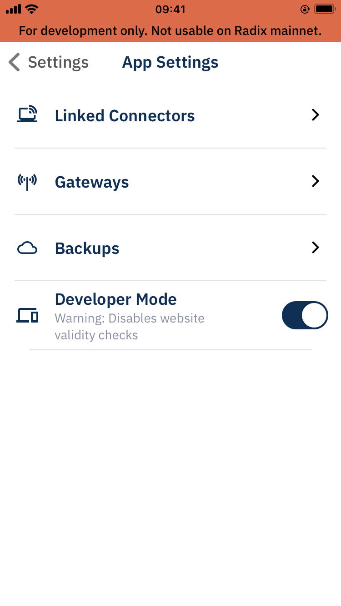
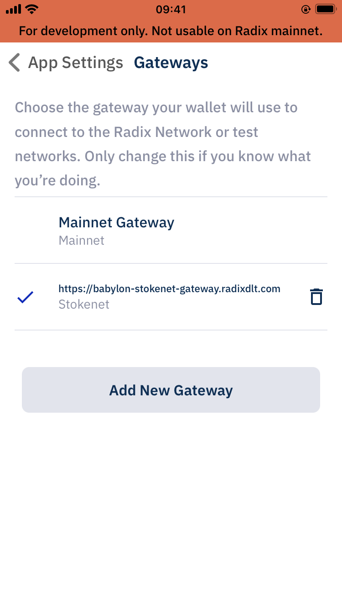
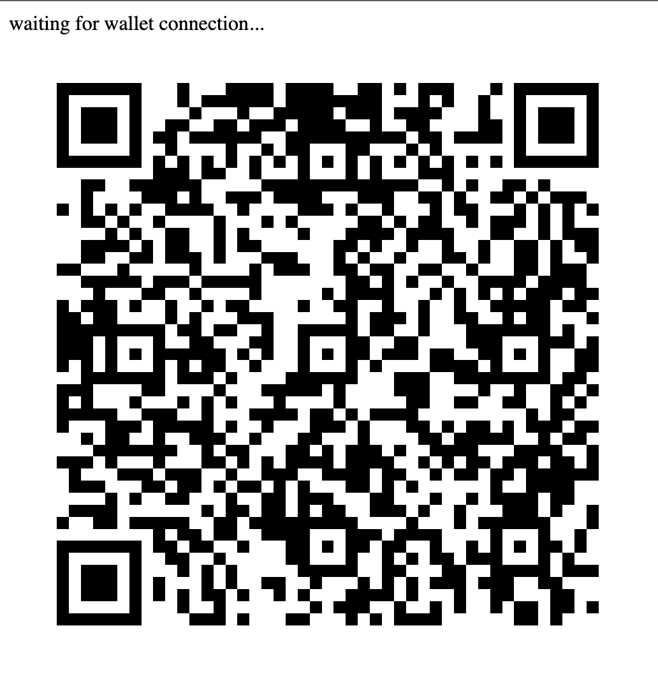
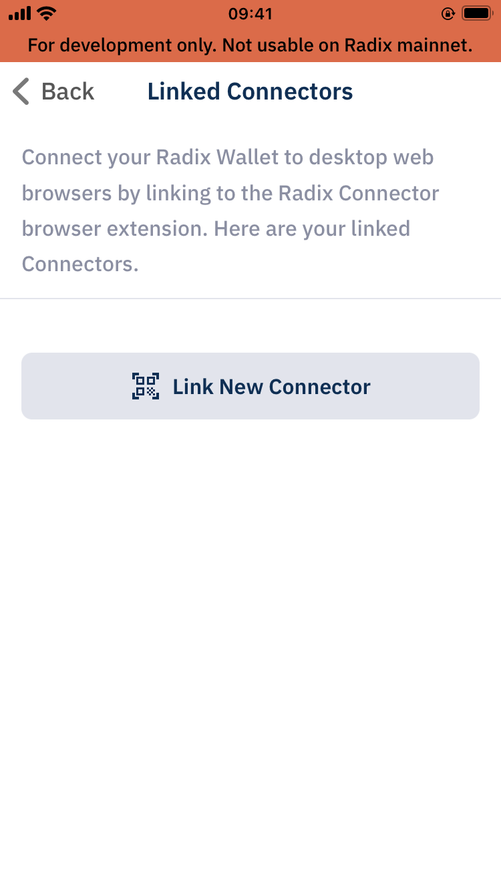

# Headless Radix Connect

> ⚠️ **Warning**:
> This code is experimental and not meant to be used in a production environment. Use on your own risk.

## Why use this?

Headless Radix Connect enables use cases where a user does not have access to a browser/connector extension, e.g. telegram bot or in-game transactions.

## What is this?

A nodejs express server that establishes a p2p connection through webRTC to send dApp requests to the Radix Wallet.

## Getting started

```bash
# install dependencies
npm install

# dev server runs on http://localhost:3000
npm run dev
```

## Radix Wallet preparations

Make sure that the wallet has `Developer mode` enabled



Gateway is set to Stokenet



## Running the code

The first time you run the dev server you will see a QR code containing the connection password (32 byte random string).



Add link by Clicking `Link new Connector` and scanning the QR code.



## Connection password

For convenience the connection password is stored in the file system at the project root level. If you want to display the QR code again run `npm run reset` or manually delete `connection-password.txt`.

## License

All code in this repository is licensed under the modified MIT license described in [LICENSE](/LICENSE).
