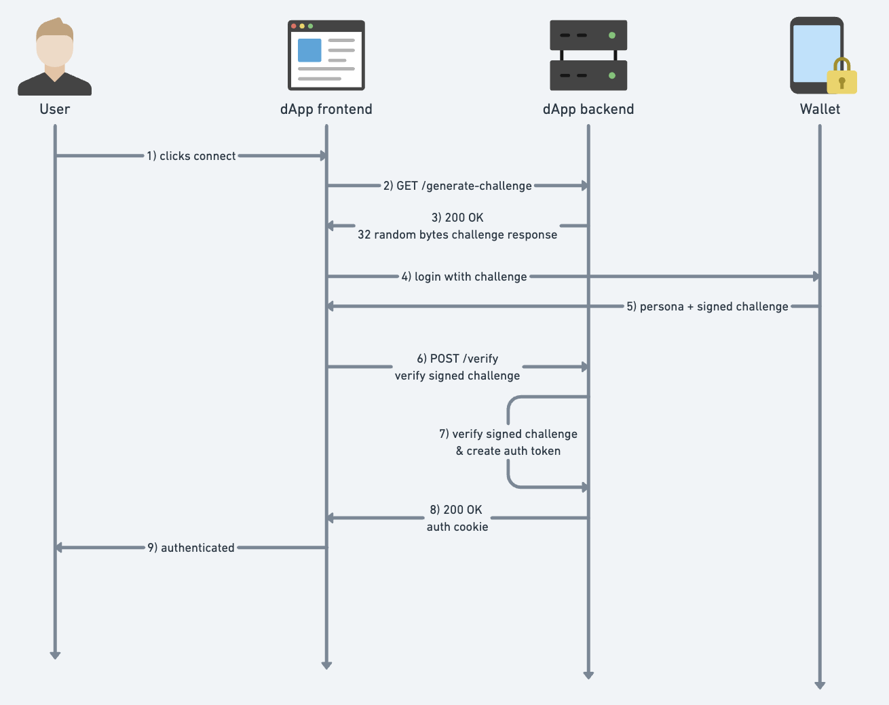
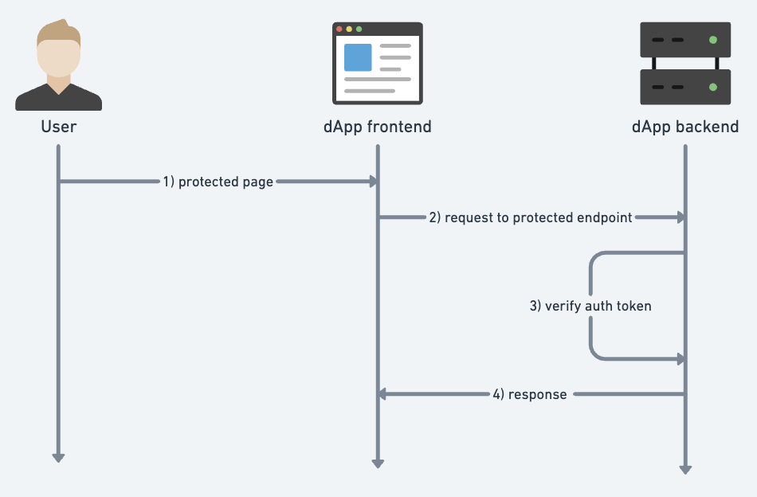

# Serverless Full-stack dApp

Scrypto is awesome, but web development is not. This is an attempt to make web development a bit less painful. Serverless Full-stack dApp has all you need to build and deploy a [Radix fullstack dApp](https://docs.radixdlt.com/docs/building-a-full-stack-dapp) using [Sveltekit](https://kit.svelte.dev) and [The Serverless Stack](https://sst.dev/).

- [Serverless Full-stack dApp](#serverless-full-stack-dapp)
  - [Who is this for?](#who-is-this-for)
  - [What is it?](#what-is-it)
  - [Why serverless?](#why-serverless)
  - [Why AWS?](#why-aws)
  - [Authentication](#authentication)
  - [Persistent login](#persistent-login)
- [Getting started](#getting-started)
  - [AWS Profile](#aws-profile)
  - [JWT secret](#jwt-secret)
  - [Developing](#developing)
  - [Deploy](#deploy)
  - [License](#license)

## Who is this for?

For the builder who has graduated from the scrypto development phase and is ready to enter the jungle of web development.

## What is it?

A starter repository containing everything a developer needs to start on the front- and backend parts of their dApp. And when ready, a one-click script to deploy a cost-effective production-grade serverless infrastructure to AWS.

**Sveltekit** - a popular modern web framework with UI and server conveniently baked together.

**ROLA authentication** - persona authentication with short-lived challenges stored in a database.

**The Serverless Stack** - An easy-to-use framework to build and deploy serverless applications on AWS. Abstractions over lower-level APIs such as Cloud development kit and Cloud formation templates, optimized for modern web frameworks. Has good community support and is extendable with a growing number of plugins.

**Persistent login** - JWT authentication with short-lived auth token and long-lived refresh token, more about authentication in the authentication section.

**User database** - Dynamodb, an AWS-created schemaless document database wired for serverless infrastructure. Can easily be replaced by another db of the builder’s choosing, the db part of the code was built with replaceability in mind.

## Why serverless?

The strongest selling point for serverless infrastructure is not having to do dev-ops-related work to keep the web application infrastructure alive and handle user traffic at scale and geo-location. This saves the developer countless hours and she can focus on the application development and running the business side of things. Another benefit is that you only pay for the amount of compute that your application requires. Depending on your application needs, this is in most cases a good model that scales together as your business and user base grows.

Today there are many flavors of serverless and companies that provide services tailored to niche users. In most cases, these services are abstractions over the cloud provider offerings and cost an arm and a leg when the application starts gaining traction.

Deploying serverless infrastructure directly to AWS eliminates added costs from middlemen and the application can handle millions of users.

## Why AWS?

Not only the largest cloud computing provider, AWS has generous free tiers that remove the barrier to entry for builders to test out their dApps without committing significant money up-front.

**CloudFront - CDN**

- 1 TB of data transfer out to the internet per month
- 10,000,000 HTTP or HTTPS Requests per month
- 2,000,000 CloudFront Function invocations per month
- Free SSL certificates
- No limitations, all features available

**Lambda - On-demand code as functions**

Offer a free tier including 1 million requests per month and 400,000 GB-seconds of compute time per month. This free tier does not automatically expire at the end of your 12-month AWS Free Tier term but is available indefinitely.

**Database - dynamoDB**

The free tier for DynamoDB provides 25GB of storage, along with 25 provisioned Write and 25 provisioned Read Capacity Units (WCU, RCU) which is enough to handle 200M requests per month.

## Authentication


1 ) User clicks connect in Radix Connect Button.

2-3 ) A request is sent to the dApp backend to generate a short-lived challenge. The challenge is stored in a persistent storage.

4-5 ) A login request is sent to the wallet and the wallet responds with a persona and signed challenge response.

6-8 ) A verify request with the signed challenge as body is sent to the dApp backend. The signed challenge is verified with ROLA.

If the signed challenge is valid a user is added to the user database, and a refresh token is created and stored in the user’s browser.

9 ) The user is now authenticated and can access protected pages of the dApp.

## Persistent login

The user login is persisted by an authentication scheme that uses two types of bearer tokens, a long-lived refresh token stored in a cookie and a short-lived auth token. This authentication scheme tries to prevent bad actors from gaining unlimited access to protected user resources by limiting the life span of the auth token. The scheme is commonly known as Oauth2.0 and is used by countless production applications on the web.



1. A logged-in user tries to access a page that requires authentication.

2. A request containing a refresh token (auth cookie) is made to obtain a short-lived auth token.

3. The token is verified and a short-lived auth token is created. The auth token is included in the request header. The dApp backend logic checks if the user has authorization to access the page based on the identity address.
4. A response is handed back to the dApp frontend.

# Getting started

## AWS Profile

Follow this guide to setup an [AWS profile](https://sst.dev/chapters/create-an-iam-user.html)

## JWT secret

Set a JWT secret that is needed for token verification. Make sure this value is secure by using a combination of alpha numberical values with symbols and mixed casing.

```bash
npx sst secrets set jwtSecret SUPER_SECRET_DO_NOT_SHARE --stage Stokenet

```

## Developing

Once you've installed dependencies with `npm install` (or `pnpm install` or `yarn`), start a development server:

```bash
npm run sst:dev

npm run dev
```

## Deploy

To deploy a production version of your app:

```bash
npm run sst:deploy
```

## License

All code in this repository is licensed under the modified MIT license described in [LICENSE](/LICENSE).
